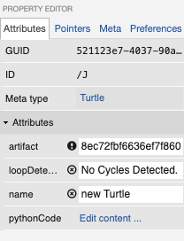

# MICProject
## Installation

There is an environment.yml file that can be utilized for local development testing. This file can be
activated utilizing Anaconda.

Docker Compose has been implemented to be able to start this project with little set up
assuming docker and docker-composer are already installed, run
`docker-compose up -d` which will start the Webgme server and MongoDB docker containers

Navigate to `localhost:8888 `

## Plugins

There are 4 main plugins

1. ModelChecker() to check that there are no infinite loops

2. TurtleCodeGenerator() will generate the text based representation of the turtle using svg_turtle and utilized mako 
   template tcg_template.txt. After this plugin is run successfully, the green success box will have a link
   to be able to download/export the python file

   
   
3. TurtleCodeImporter() is used to have the user select a python file that would import into the visual model representation
   
   
4. TurtleSVGCreator() is used to have an iFrame that shows the SVG of the created picture.
   

## Commands

•	Commands used: penup, pendown, clear, color, forward, right, left, width, goto, and functions that have an attribute loopCount

## Control Flow
•	Functions can be defined and have a simple loopCount that builds a for loop in the generated output code.